<div align="center">


[portfolio](https://nueva.my.id) &nbsp;·&nbsp;
[blog](https://blog.nueva.my.id) &nbsp;·&nbsp;
[resume](https://nueva.my.id/resume) &nbsp;·&nbsp;
[xssscope](https://github.com/Nueeva/xssscope) &nbsp;·&nbsp;
[clouvia](https://linktr.ee/die_de_nueva) &nbsp;·&nbsp;
[linkedin](https://linkedin.com/in/Nueva) &nbsp;·&nbsp;
[email](mailto:rifqiariansyah123@gmail.com)

</div>

<br/>


# Hi 👋, I'm Rifqi Ariansyah
### Passionate Developer focused on Web Security, Cryptography & Systems Architecture

Saya merupakan seorang pengembang yang belajar secara otodidak dengan ketertarikan mendalam pada Application Security, Cryptography, dan Web Platforms.

- 🔭 Building **[xssscope](https://github.com/Nueeva/xssscope)** — Dependency-free Reflected XSS Scanner
- 🛡️ Specializing in **Web Security**, Vulnerability Research & Penetration Testing
- 💼 Working on **[Clouvia](https://linktr.ee/die_de_nueva)**
- 👯 Open to collaborations on **AppSec tooling & Web Security**
- 💬 Ask me about **Web Security, Node.js, and System Penetration**
- 📫 Reach me at: [rifqiariansyah123@gmail.com](mailto:rifqiariansyah123@gmail.com)
- 👨‍💻 Portfolio: [nueva.my.id](https://nueva.my.id) · Blog: [blog.nueva.my.id](https://blog.nueva.my.id) · Resume: [nueva.my.id/resume](https://nueva.my.id/resume)

<br/>


<div align="center">

<a href="https://github.com/Nueeva/xssscope">
  
</a>

<p align="center">
  <a href="https://github.com/Nueeva/xssscope/blob/main/LICENSE"></a>
  <a href="https://nodejs.org"></a>
  
  
  <a href="https://github.com/Nueeva/xssscope/stargazers"></a>
</p>

</div>

### 🔍 [xssscope](https://github.com/Nueeva/xssscope) — Reflected XSS Scanner with Context Detection
> *Zero dependencies. Probe, classify, verify.*

Most scanners fire arbitrary payload banks at every query param, causing false positives and wasted time. **xssscope** operates backwards:
1. **Probe first:** Injects an inert canary to verify if reflection actually occurs.
2. **Classify context:** Identifies the precise sink (element text, quoted/unquoted attribute, script string, or HTML comment).
3. **Targeted payload:** Dispatches only the payload crafted for that exact breakout syntax.
4. **Byte-exact verification:** Confirms execution only when returned unescaped and syntactically valid.

<div align="center">
  <a href="https://github.com/Nueeva/xssscope">
    
  </a>
</div>

```bash
# Quick run (zero npm install required)
git clone https://github.com/Nueeva/xssscope.git
node xssscope/bin/cli.js --target http://localhost:8080
```

👉 **[Explore the Repository & Documentation →](https://github.com/Nueeva/xssscope)**

<br/>

**Other Projects:**
* **[Clouvia](https://linktr.ee/die_de_nueva)** &nbsp;·&nbsp; Cloud hosting, infrastructure, and web platforms.
* **[nueva.my.id](https://nueva.my.id)** &nbsp;·&nbsp; Personal portfolio showcasing security projects, writeups, and full-stack systems.

<br/>


<p align="center">
  
  
  
  
  
  
  
  
  
  
  
  
  
</p>

<br/>


<div align="center">




<br/>


</div>

<br/>

## 🌐 Connect With Me

<p align="center">
  <a href="https://twitter.com/nueeva"></a>
  <a href="https://linkedin.com/in/Nueva"></a>
  <a href="https://discord.com/users/Clouvia"></a>
  <a href="https://instagram.com/nueeva"></a>
  <a href="https://wa.me/+6281212994597"></a>
  <a href="https://t.me/nueva_inc"></a>
</p>

<br/>


Every graphic here is self-generated, not embedded from third-party hosting services.<br>
`ascii.svg` renders typewriter-animated monochrome ASCII branding with SMIL;<br>
the stat graphics and section headings are drawn by a [scheduled GitHub Action](.github/workflows/stats.yml)<br>
straight from the GitHub GraphQL API, once a day, committing only what changed.

They animate via SMIL inside the SVG because GitHub strips scripts and inline CSS from READMEs.<br>
Because nothing loads from external analytics hosts, nothing can rate-limit, break, or go dark.<br>
The typeface is [JetBrains Mono](scripts/fonts), subsetted to character usage and inlined as base64.
